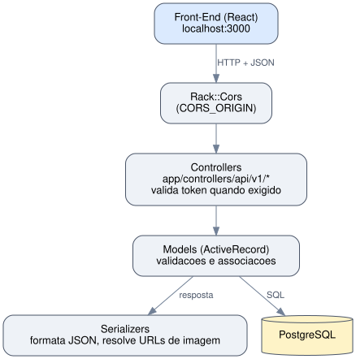
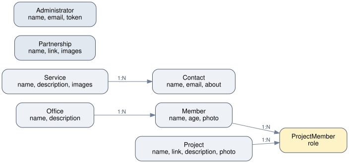

# Struct - API do Site Institucional

Projeto final do processo trainee 2022 da **Struct**, empresa junior de Engenharia de Computacao da Universidade de Brasilia. API RESTful em Ruby on Rails que sustenta o site institucional, com CRUD de membros, cargos, projetos, servicos, parcerias e contatos, alem de autenticacao de administradores por token e upload de imagens via ActiveStorage.

> **Front-End:** [Projeto-Final-Struct-Front-End](https://github.com/GustavoVieiraDeAraujo/Projeto-Final-Struct-Front-End)

---

## Sumario

- [Struct - API do Site Institucional](#struct---api-do-site-institucional)
  - [Sumario](#sumario)
  - [Colaboradores](#colaboradores)
  - [Tecnologias](#tecnologias)
  - [Escopo do Projeto](#escopo-do-projeto)
  - [Estrutura do Projeto](#estrutura-do-projeto)
  - [Requisitos](#requisitos)
  - [Configuracao](#configuracao)
  - [Como Executar](#como-executar)
  - [Arquitetura](#arquitetura)
  - [Modelo de Dados](#modelo-de-dados)
  - [Endpoints da API](#endpoints-da-api)
  - [Autenticacao](#autenticacao)
  - [Testes](#testes)

---

## Colaboradores

| Nome | GitHub |
|---|---|
| Gustavo Vieira de Araujo | [@GustavoVieiraDeAraujo](https://github.com/GustavoVieiraDeAraujo) |

---

## Tecnologias

| Tecnologia | Uso |
|---|---|
| Ruby 2.7.2 | Linguagem |
| Rails 6.1.6 (API-only) | Framework web |
| PostgreSQL | Banco de dados |
| Devise + simple_token_authentication | Autenticacao de administradores por token |
| ActiveStorage | Upload de fotos/imagens (membros, projetos, servicos, parcerias) |
| active_model_serializers | Serializacao JSON das respostas |
| RSpec + FactoryBot | Testes automatizados |
| Faker | Populacao de dados de desenvolvimento (db/seeds.rb) |
| figaro | Configuracao de variaveis de ambiente via application.yml |
| Rack::Cors | Liberacao de CORS para o front-end |

---

## Escopo do Projeto

| Recurso | Implementacao |
|---|---|
| CRUD de Membros | `MembersController`, inclui upload de foto (`add_photo`) |
| CRUD de Cargos (Offices) | `OfficesController`, cada membro pertence a um cargo |
| CRUD de Projetos | `ProjectsController`, inclui upload de foto (`add_photo`) |
| CRUD de Servicos | `ServicesController`, inclui upload/remocao de multiplas imagens |
| CRUD de Parcerias | `PartnershipsController`, inclui upload/remocao de multiplas imagens |
| CRUD de Contatos | `ContactsController`, formulario de contato vinculado a um servico |
| Associacao Projeto x Membro | `ProjectMembersController`, tabela de juncao com papel (`role`) do membro no projeto |
| Autenticacao de administradores | `AdministratorsController#login/#logout`, via Devise + token nos headers `X-Administrator-Email`/`X-Administrator-Token` |
| Paginacao | Endpoint `index_pagination/:page` em todos os recursos principais |

---

## Estrutura do Projeto

| Diretorio / Arquivo | Descricao |
|---|---|
| `app/controllers/api/v1/` | Um controller por recurso (members, offices, projects, services, partnerships, contacts, project_members, administrators) |
| `app/models/` | Modelos ActiveRecord com validacoes e associacoes |
| `app/serializers/` | Um `ActiveModel::Serializer` por entidade, expondo URLs de imagens via ActiveStorage |
| `config/routes.rb` | Rotas da API sob `api/v1`, com acoes nomeadas (`show/:id`, `delete/:id`, etc.) |
| `config/initializers/cors.rb` | CORS configuravel via `CORS_ORIGIN` (padrao `localhost:3000`) |
| `config/application.yml.example` | Template das variaveis de ambiente lidas pela gem figaro |
| `db/migrate/` | Migracoes do banco |
| `db/schema.rb` | Schema atual do banco |
| `db/seeds.rb` | Popula o banco com dados fake (Faker) e imagens de `public/` |
| `public/` | Imagens estaticas usadas pelo seed (fotos, logos) |
| `spec/models/` | Testes de validacao dos modelos (RSpec) |
| `spec/requests/api/v1/` | Testes de requisicao por endpoint (RSpec) |
| `spec/factories/` | Factories para os testes (FactoryBot) |

---

## Requisitos

- Ruby 2.7.2
- Rails 6.1.6
- PostgreSQL

```bash
# Ubuntu/Debian
sudo apt install postgresql libpq-dev
```

---

## Configuracao

```bash
cp config/application.yml.example config/application.yml
```

Edite `config/application.yml` com as credenciais do seu PostgreSQL (`db_user`, `db_password`) e, se necessario, a origem permitida pelo CORS (`CORS_ORIGIN`, padrao `localhost:3000`). O arquivo e lido pela gem `figaro` e ignorado pelo git.

---

## Como Executar

```bash
# Instalar dependencias
bundle install

# Criar e popular o banco
rails db:create
rails db:migrate
rails db:seed

# Iniciar o servidor (porta 3333, esperada pelo front-end)
rails s -p 3333
```

O seed cria 10 registros de cada entidade principal (membros, cargos, projetos, servicos, parcerias) e 1 administrador, usando imagens de `public/` como fotos/logos de exemplo.

---

## Arquitetura

API-only Rails, sem views/sessions: MVC simples com uma camada de serializers entre os models e a resposta JSON.



Ordem de uma requisicao, de cima para baixo:

| # | Camada | Responsabilidade | Onde |
|---|---|---|---|
| 1 | CORS | Libera a origem configurada em `CORS_ORIGIN` | `config/initializers/cors.rb` |
| 2 | Controller | Recebe a requisicao, valida token (quando exigido) e chama o Model | `app/controllers/api/v1/*` |
| 3 | Model | Validacoes e associacoes ActiveRecord | `app/models/*` |
| 4 | Serializer | Formata a resposta JSON e resolve URLs de imagem (ActiveStorage) | `app/serializers/*` |
| 5 | Banco | Persistencia | PostgreSQL |

Cada controller segue o mesmo padrao de acoes: `index`, `index_pagination/:page`, `show/:id`, `create`, `update/:id`, `delete/:id`, com `rescue StandardError => e; render json: {message: e.message}, status: ...` para erros.

---

## Modelo de Dados



| Entidade | Campos principais | Relacoes |
|---|---|---|
| `Administrator` | name, email, encrypted_password, authentication_token | Nenhuma |
| `Office` | name, description | `has_many :members` |
| `Member` | name, age, photo | `belongs_to :office`, `has_many :project_members` |
| `Project` | name, link, description, photo | `has_many :project_members` |
| `ProjectMember` | role | `belongs_to :member`, `belongs_to :project` |
| `Service` | name, description, images | `has_many :contacts` |
| `Contact` | name, email, about | `belongs_to :service` |
| `Partnership` | name, link, images | Nenhuma |

**Relacionamentos entre entidades:**

| Entidade A | Cardinalidade | Entidade B | Observacao |
|---|---|---|---|
| Office | 1:N | Member | Um cargo tem varios membros |
| Member | N:M | Project | Via `ProjectMember`, que carrega o campo `role` |
| Service | 1:N | Contact | Um servico recebe varios contatos |
| Partnership | N/A | N/A | Entidade independente (sem chave estrangeira) |
| Administrator | N/A | N/A | Entidade independente (autenticacao) |

---

## Endpoints da API

Base: `http://localhost:3333/api/v1`

| Recurso | Rotas |
|---|---|
| `members` | `GET index`, `GET index_pagination/:page`, `GET show/:id`, `POST create`, `POST add_photo/:id`, `PATCH update/:id`, `DELETE delete/:id` |
| `offices` | `GET index`, `GET index_pagination/:page`, `GET show/:id`, `POST create`, `PATCH update/:id`, `DELETE delete/:id` |
| `projects` | `GET index`, `GET index_pagination/:page`, `GET show/:id`, `POST create`, `POST add_photo/:id`, `PATCH update/:id`, `DELETE delete/:id` |
| `services` | `GET index`, `GET index_pagination/:page`, `GET show/:id`, `POST create`, `POST add_images/:id`, `PATCH update/:id`, `DELETE delete/:id`, `DELETE delete_all_images/:id` |
| `partnerships` | `GET index`, `GET index_pagination/:page`, `GET show/:id`, `POST create`, `POST add_images/:id`, `PATCH update/:id`, `DELETE delete/:id`, `DELETE delete_all_images/:id` |
| `contacts` | `GET index`, `GET index_pagination/:page`, `GET show/:id`, `POST create`, `PATCH update/:id`, `DELETE delete/:id` |
| `project_members` | `GET index`, `GET index_pagination/:page`, `GET show/:id`, `POST create`, `PATCH update/:id`, `DELETE delete/:id` |
| `administrators` | `POST login`, `DELETE logout`, `GET index`, `GET show/:id`, `POST create`, `PATCH update/:id`, `DELETE delete/:id` |

---

## Autenticacao

Feita via Devise + `simple_token_authentication`, sem sessao/cookie no servidor: cada requisicao autenticada carrega o token nos headers.

1. `POST administrators/login` com `email`/`password` retorna `id`, `name`, `email` e `authentication_token`.
2. O cliente guarda o token e passa a enviar `X-Administrator-Email` e `X-Administrator-Token` em toda requisicao de escrita.
3. `acts_as_token_authentication_handler_for Administrator` valida esses headers antes de executar a acao; token invalido ou ausente retorna redirecionamento/401.
4. `DELETE administrators/logout` limpa o `authentication_token` do administrador no banco, invalidando o token atual.

`index`/`show` de `administrators` **nao** expoem `authentication_token` de nenhum administrador (nem o proprio). O token so aparece na resposta do `login`, que e a unica acao que precisa dele.

---

## Testes

```bash
bundle exec rspec
```

```
145 examples, 0 failures, 1 pending
```

16 arquivos de spec cobrindo validacoes de modelo (`spec/models/`) e status/content-type das requisicoes de cada endpoint (`spec/requests/api/v1/`), incluindo login/logout, CRUD autenticado e os fluxos de erro (não encontrado, parametros invalidos).

---

> Documentacao gerada com auxilio de IA.
